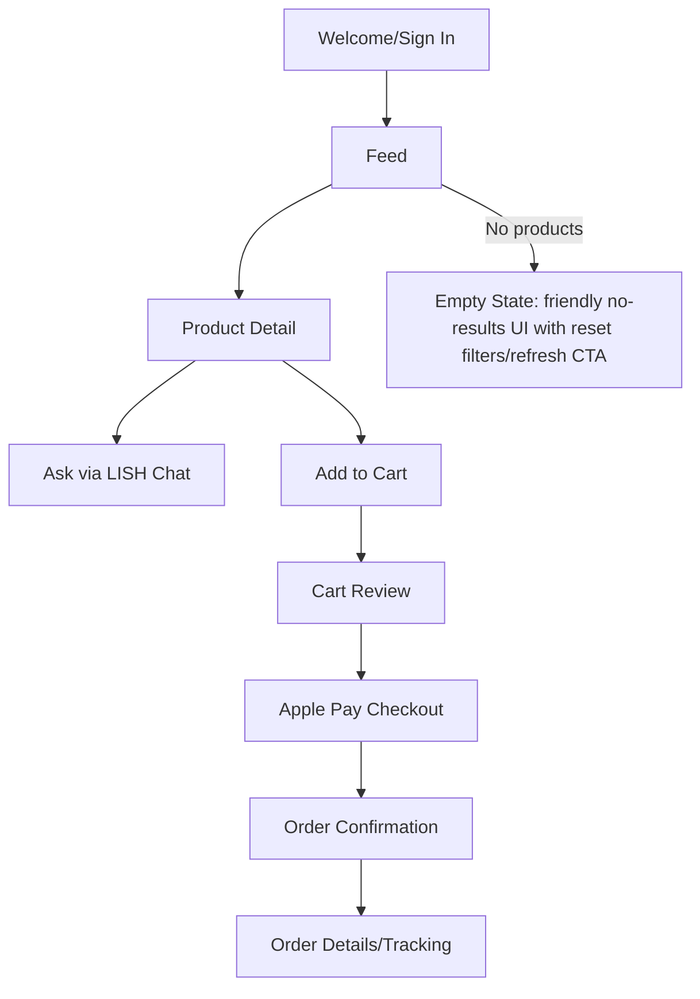
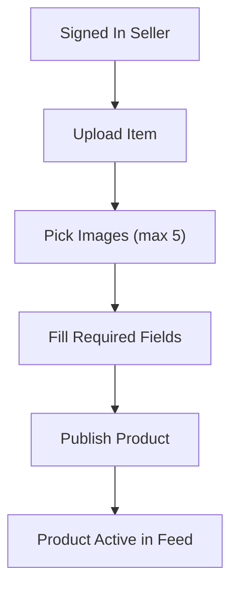
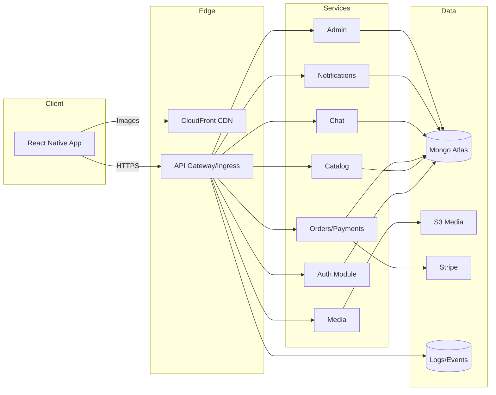
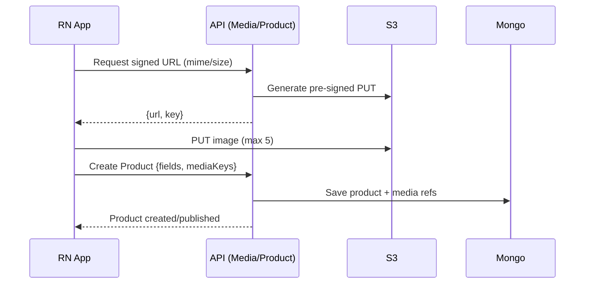
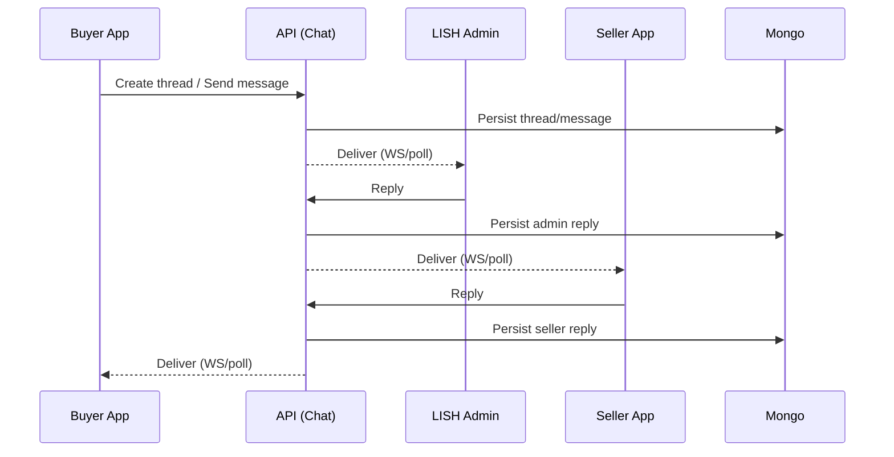
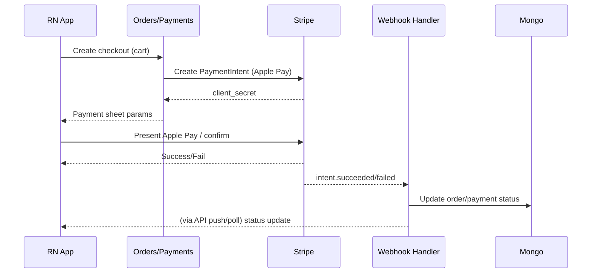

# LISH MVP Plan (Presentation)

## 1. What We’re Building
- iOS-first sustainable fashion marketplace MVP with modern UX.
- Core flows: auth (email + Apple), infinite feed, product detail, seller upload (<=5 imgs), admin-relay chat, Apple Pay checkout, order status, basic notifications.
- Excluded now: ratings/reviews, follows/profiles, AI/similar items, complex filters, product video, advanced logistics/non-Apple processors.

## 2. Users & Principles
- Target: second-hand fashion buyers/sellers (16–50), want curated, modern, safe experience.
- Safety: no direct buyer-seller chat; minimal PII; admin-mediated interactions.
- Speed vs control: two stack paths (AWS/control-first vs Firebase/speed-first).

## 3. Architecture Snapshot (default)
- Frontend: React Native (TS), React Query, Navigation; Stripe Apple Pay; WS or polling chat.
- Backend: Node TS (Fastify/Nest) modular services: auth, catalog, media, orders/payments, chat, notifications, admin.
- Data: Mongo (users, products, mediaAssets, carts, orders, chatThreads/messages, events/logs).
- Media: S3 + CloudFront; signed uploads, mime/size caps.
- Payments: Stripe Payment Intents (Apple Pay), webhook confirmation.
- Observability: Sentry, structured logs, basic alerts.

## 4. Data Highlights
- Products: seller, media refs (<=5), category/size/condition/price, status.
- Orders: items with priceAtPurchase, Stripe intent IDs, order/payment status.
- Chat: threads + messages with senderRole (buyer/seller/admin); audit log.
- Indexes: products by status+createdAt, seller; chats by thread+createdAt; orders by user; users unique email/username/appleSub.

## 5. MVP Feature Checklist
- Auth: email/password, Apple ID, JWT/refresh, username capture.
- Feed: cursor pagination, basic filters (category/size/gender/condition/material/style).
- Product page: gallery (<=5), description, price, seller label, add to cart, ask via LISH.
- Upload: picker cap 5, required fields (category, size, price, quality note), publish.
- Chat: admin relay, no media, PII guard.
- Cart/Checkout: cart CRUD, Apple Pay sheet, order create/track, receipt.
- Notifications: in-app; push if time.

## 6. Stack Options
- Frontend: Bare RN (control) vs Expo (faster, needs custom dev client for Apple Pay).
- Backend: Node (Fastify/Nest) vs Firebase Functions vs AWS Lambda via SST/Serverless.
- Data: Mongo (default) vs Postgres vs Firestore.
- Hosting: AWS (default) vs Firebase vs Render/Fly.
- Chat: WS vs polling vs Firestore realtime (if Firebase).
- Admin UI: minimal web vs CLI vs Retool-like.

## 7. Execution Plan — AWS / Control-First (Weeks)
1) Foundations/infra: repos, CI, IaC (API GW+Lambda or ECS), S3/CF, Mongo, Stripe webhook stub, Sentry/logging.
2) Auth + Feed: auth routes, Apple verify, rate limits; feed API + filters; RN auth + feed.
3) Product + Cart shell: product detail; cart endpoints + UI shell.
4) Uploads: signed URLs, validations; RN upload/publish.
5) Chat: WS/polling, threads/messages, admin role, RN chat.
6) Payments/Orders: PaymentIntent, webhook, order status; RN Apple Pay + order detail.
7) QA/Launch: E2E, perf, analytics, seeds, TestFlight, go/no-go.

## 8. Execution Plan — Firebase / Speed-First (Weeks)
1) Firebase projects, Auth (email/Apple), Firestore/Storage/Functions, rules skeleton; app shell.
2) Auth + Feed: login/signup, Firestore feed w/ pagination+filters; indexes.
3) Product + Cart shell: product detail; cart client or Firestore doc.
4) Uploads: Storage upload rules, media metadata in Firestore; product create/publish.
5) Chat: Firestore threads/messages realtime; admin role; RN chat.
6) Payments/Orders: Function for PaymentIntent, webhook Function, order docs; RN Apple Pay + order detail.
7) QA/Launch: E2E, perf (queries/storage sizes), analytics/crash, seeds, TestFlight.

## 9. Security/Quality
- Validation everywhere, rate limits (auth/chat/uploads), JWT rotation.
- PII guard in chat; signed uploads; Stripe webhook verification; audit logs.
- Tests: unit, integration, E2E happy paths (login, feed→product→chat/cart→Apple Pay, upload).
- Perf: feed indexes, CDN for images, chat reconnect/backoff.

## 10. Decisions to Make (when ready)
- Stack path: AWS/control-first vs Firebase/speed-first (or Render/Fly middle-ground).
- Frontend flavor: bare RN vs Expo (custom dev client for Apple Pay if Expo).
- Chat transport: WS vs polling initial.
- Admin surface: minimal web vs CLI vs tooling.

----------------------------------------------------------------------------------------
# LISH MVP Specifications
### Core Specifications 

- **[00_overview.md](mvp_specs/00_overview.md)** - MVP Overview
  - Project goals and scope
  - In-scope and out-of-scope features
  - Key assumptions and platform decisions

- **[01_architecture.md](mvp_specs/01_architecture.md)** - Architecture
  - System architecture diagram
  - Frontend, backend, and data layer design
  - Media handling, chat, payments, and notifications architecture

- **[02_data_models.md](mvp_specs/02_data_models.md)** - Data Models
  - MongoDB schema definitions
  - Collections: users, products, mediaAssets, carts, orders, chatThreads, chatMessages
  - Indexes and data relationships

- **[03_backend.md](mvp_specs/03_backend.md)** - Backend API
  - Node.js/TypeScript backend stack
  - API endpoints for auth, catalog, media, cart, orders, chat, and admin
  - Validation, error handling, and background jobs

- **[04_mobile.md](mvp_specs/04_mobile.md)** - Mobile App
  - React Native implementation details
  - Screen flows and user journeys
  - Component library and state management
  - Error handling and accessibility

### Infrastructure & Operations

- **[05_infra_ops.md](mvp_specs/05_infra_ops.md)** - Infrastructure & Operations
  - AWS infrastructure setup
  - CI/CD pipeline configuration
  - Networking, security, and observability
  - Storage and deployment strategies

- **[06_security_quality.md](mvp_specs/06_security_quality.md)** - Security, Quality & Performance
  - Security best practices
  - Testing strategy (unit, integration, E2E)
  - Performance optimization
  - Reliability and error handling

### Planning & Execution

- **[07_delivery_plan.md](mvp_specs/07_delivery_plan.md)** - Delivery Plan
  - 7-week MVP delivery timeline
  - Weekly milestones and checkpoints
  - Key approvals and decision points

- **[08_stack_options.md](mvp_specs/08_stack_options.md)** - Stack Options
  - Technology stack comparison
  - Frontend, backend, database, and infrastructure options
  - Recommendation pathways (speed-first vs control-first)

- **[09_execution_plan_aws.md](mvp_specs/09_execution_plan_aws.md)** - Execution Plan (AWS)
  - Detailed week-by-week plan for AWS-based implementation
  - Infrastructure as Code setup
  - Backend and mobile app development phases

- **[10_execution_plan_firebase.md](mvp_specs/10_execution_plan_firebase.md)** - Execution Plan (Firebase)
  - Detailed week-by-week plan for Firebase-based implementation
  - Firebase services configuration
  - Rapid development approach

### Visual Documentation

- **[11_diagrams.md](mvp_specs/11_diagrams.md)** - System Diagrams
  - User flow diagrams (buyer and seller)
  - System architecture diagram (AWS control-first)
  - Upload & media flow sequence diagram
  - Chat flow (admin relay) sequence diagram
  - Payments & orders flow (Apple Pay via Stripe) sequence diagram
  - All diagrams in Mermaid format for easy viewing

## Key Features (MVP)

- **Authentication**: Email/password and Apple ID login
- **Product Feed**: Infinite scroll with filters (category, size, gender, condition, material, style)
- **Product Upload**: Simple seller uploads with up to 5 photos
- **Shopping Cart**: Add to cart and checkout flow
- **Payments**: Apple Pay integration via Stripe
- **Chat**: Admin-mediated chat system (buyer ↔ admin ↔ seller)
- **Orders**: Order creation, tracking, and status management
- **Notifications**: In-app notifications with optional push support

## Platform

- **Primary**: iOS (React Native)
- **Future**: Android support planned

# Diagrams (Mermaid)

## User Flow (Buyer)

## User Flow (Seller Upload)

## System Architecture (Control-First AWS)

## Upload & Media Flow

## Chat Flow (Admin Relay)

## Payments & Orders Flow (Apple Pay via Stripe)

