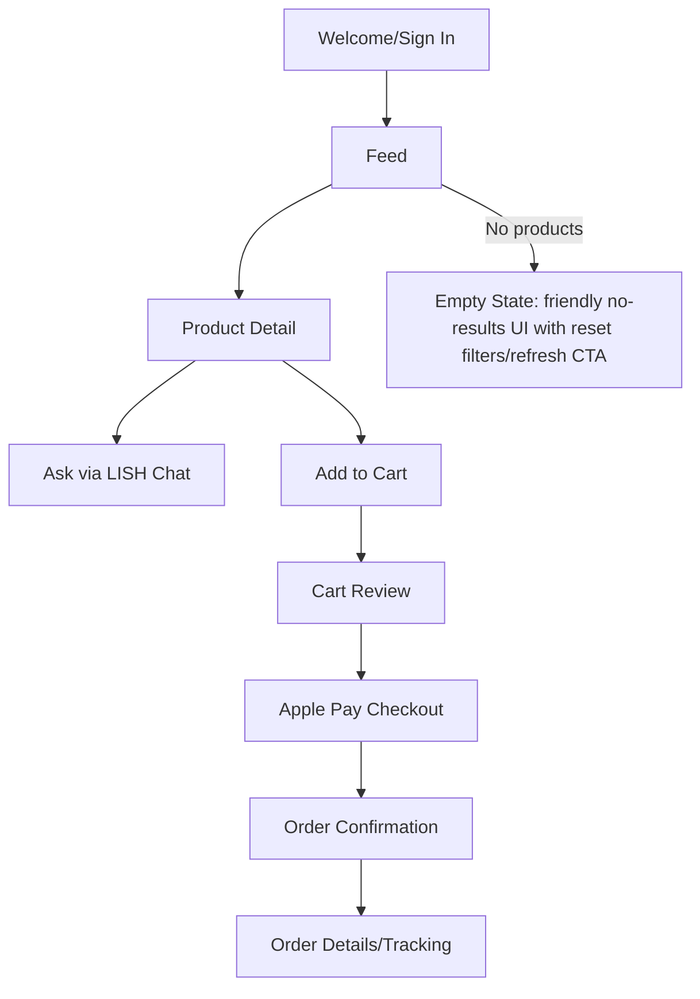
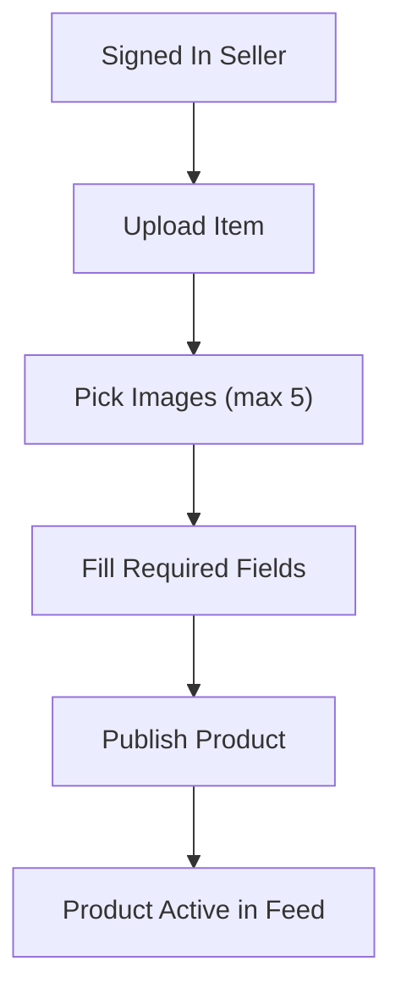
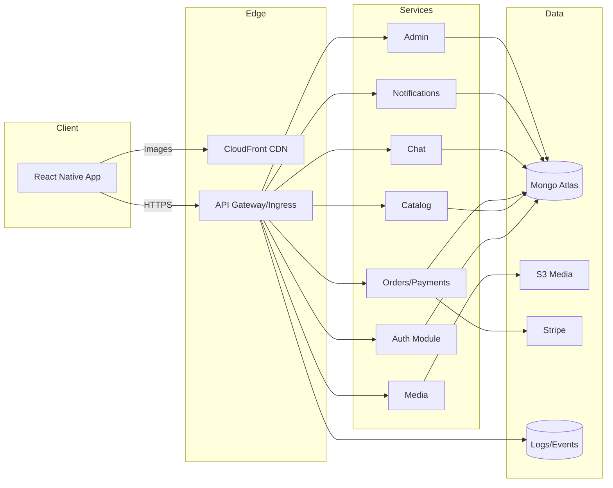
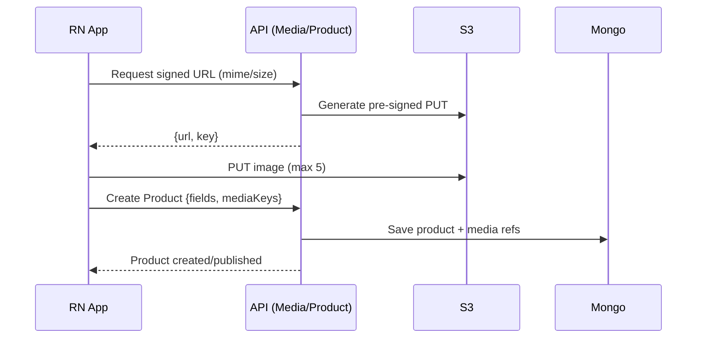
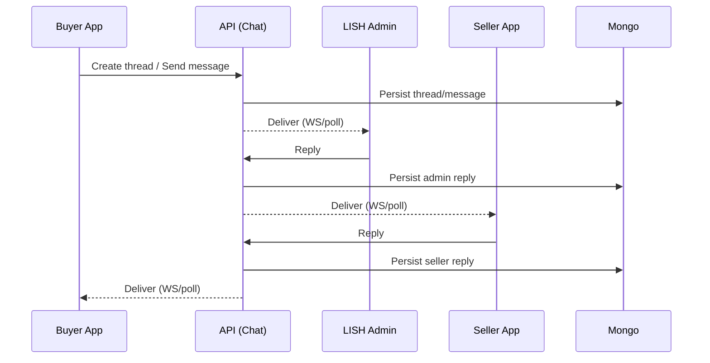
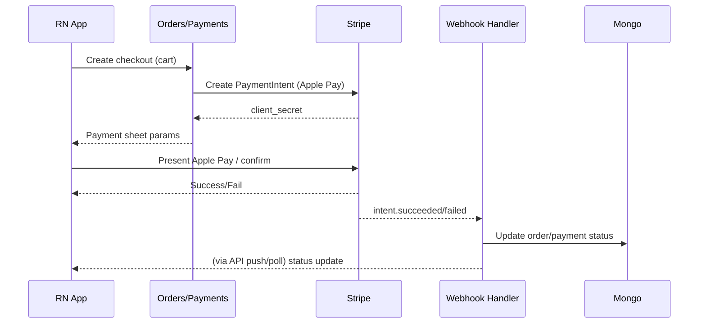

# Diagrams (Mermaid)

## User Flow (Buyer)

## User Flow (Seller Upload)

## System Architecture (Control-First AWS)

## Upload & Media Flow

## Chat Flow (Admin Relay)

## Payments & Orders Flow (Apple Pay via Stripe)

